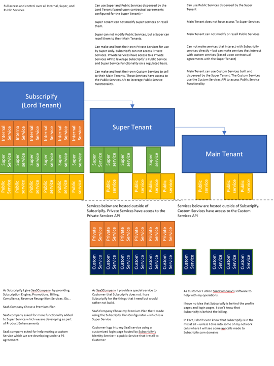

<h1 align="center">
   
  
   
  Subscripify's Tenant Spin Up service
   
</h1>

<h4 align="center">This is a Super-Service  
<a href="https://go.dev" target="_blank">Built in Go</a>.</h4>

<!-- 

  
  
  
  

 -->

  <a href="#security-considerations">Security considerations</a> 
  <a href="#purpose-of-this-service">Purpose of this Service</a> 
  <a href="#design-patterns-utilized-by-this-service">Design patterns utilized by this service</a> 
  <a href="#tenant-structure-on-subscripify">Tenant Structure on Subscripify</a> 
  <a href="#license">License</a>

<!--  -->

## Security Considerations
* This service is a protected "Super Service". 
* Only users with super-user permissions can call these apis from applications that have tenant-creator scope
* For the use case of automatically starting a tenant based upon a non-super user input (for instance - a new customer of a SaaS service delivered at the sub-tenant level starts a subscription using a subscription selector application). The appropriate pattern is to create a service principal account for the selector application and assign limited super-user permissions to the service principal. The service principals credentials will then be used to create the new tenant

## Purpose of this service

* Provide an API for super-tenants' super-user front end applications running on Subscripify's platform to create new tenants. 
* Tenant capabilities are based upon pre-configured settings managed by the Tenant-Configurator and made available to the super-tenants' by the Tenant-Delivery-Service.
* This service formats the data for entry into the organizations table in the tenant database and ensures that all data is validated before entry against the data coming from the Tenant-Configurator and business rules required for each tenant (e.g. no duplicate tenant names at the same level)
* As part of creating a new Tenant - this service is responsible for starting all jobs required to spin up the required components on the subscripify cluster(s) utilizing the k8 apis

## Design patterns utilized by this service

This service creates a new tenant based upon inputs from super-users in super user front end client applications and from plan selector apps created by the super-tenants' development teams. The inputs are standardized but - the service does not know what type of tenant - nor what other services need to be spun up within the tenant as it is being used. This service is also used by the Subscripify service (i.e. the 'Lord' service).

We are utilizing a Factory Design pattern Where a newTenant function takes in a tenant-type string, name string, configuration -strings and uses one of two create functions - a createSuperTenant or a createMainTenant depending upon a tenant type. Each create function will then utilize the client app inputs to create the new tenant - validating the data and if invalid returning an error response to the api. 

> **Note**
> If we create a new type of tenant (which is somewhat unlikely) then we would create a new create function. The tenant hierarchy and system control depends upon Lord Tenants having control over Super Tenants Functional variability. Subsequently, in kind, Super Tenants have control over Main Tenant functional variability (along with their own custom capabilities). Extension of the hierarchy downward into "sub-tenants" is unlikely but should be though of as a growth vector in the future - do not engineer this into a corner

## Tenant Structure on Subscripify

## License

Private
